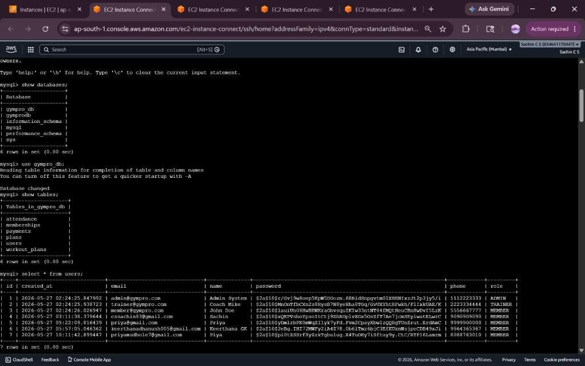
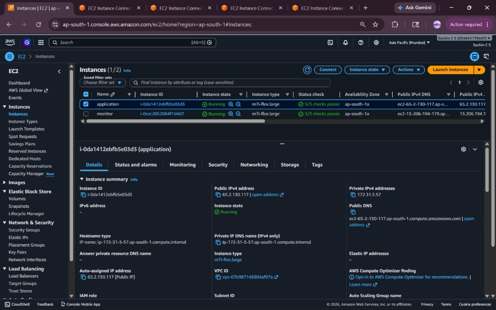
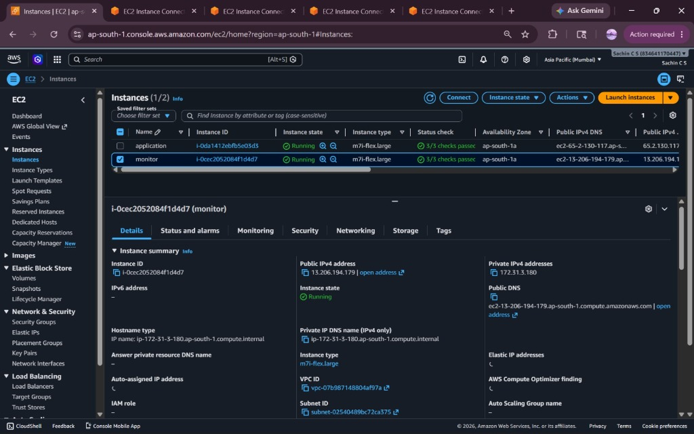
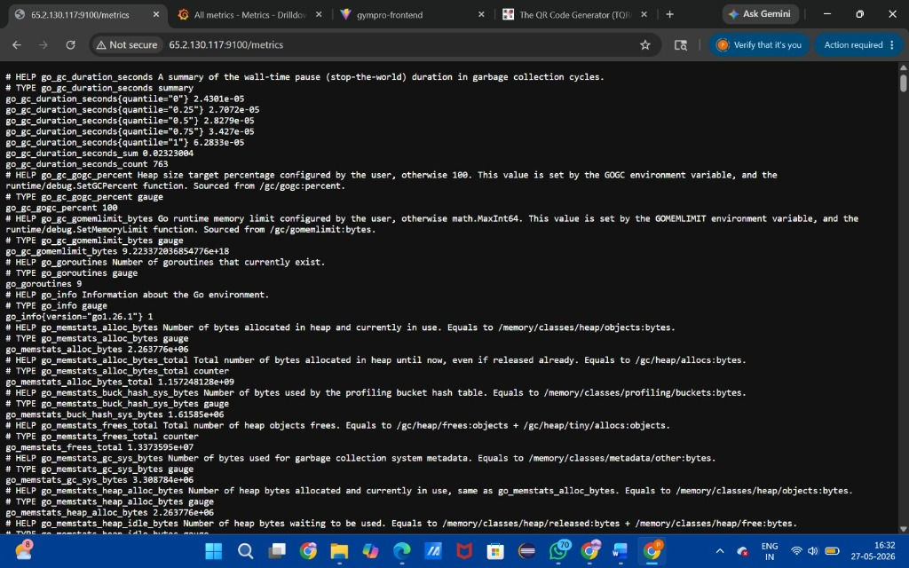
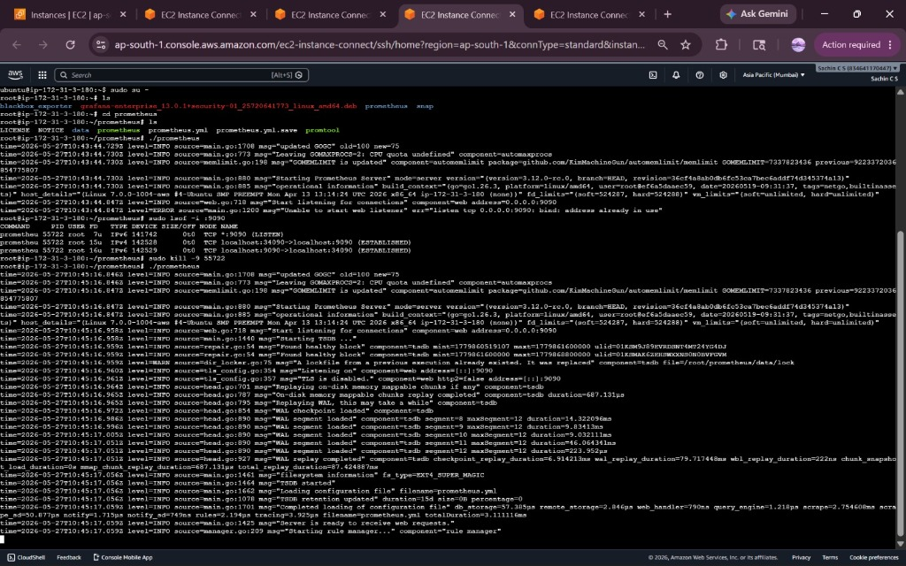
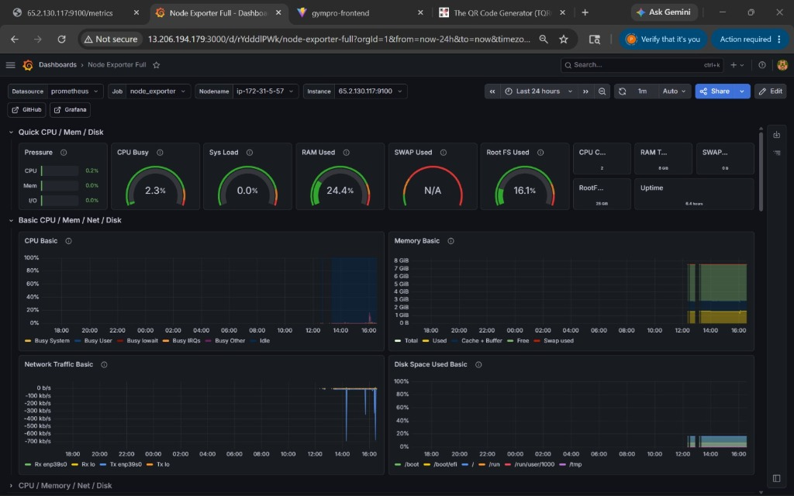

# 💎 GymPro – Premium Gym Management Platform

GymPro is a full-stack SaaS application for gym owners, trainers, and members. It features a robust Spring Boot backend and a high-performance React (Vite) frontend with a focus on premium aesthetics and user experience.

## 📸 Screenshots

### Premium Frontend Dashboard


### Backend API Documentation (Swagger)


### Production MySQL Database (AWS)


### AWS EC2 Application Instance


### AWS EC2 Monitoring Instance


### Node Exporter Metrics (Application Server)


### Prometheus Server Starting up (Monitoring Server)


### Grafana Infrastructure Dashboard (Monitoring Server)


## 🚀 Quick Start with Docker

The easiest way to get GymPro up and running is using Docker Compose.

1.  **Clone the repository**.
2.  **Run Docker Compose**:
    ```bash
    docker-compose up --build
    ```
3.  **Access the applications**:
    -   Frontend: [http://localhost](http://localhost)
    -   Backend API Docs (Swagger): [http://localhost:8080/swagger-ui/index.html](http://localhost:8080/swagger-ui/index.html)

## 🛠 Tech Stack

### Backend
-   **Java 17** & **Spring Boot 3**
-   **Spring Security** (JWT Authentication)
-   **Spring Data JPA** (MySQL Persistence)
-   **MapStruct** & **Lombok**
-   **Swagger/OpenAPI**

### Frontend
-   **React (Vite)**
-   **Tailwind CSS** (Premium Dark UI)
-   **Redux Toolkit** (State Management)
-   **Framer Motion** (Smooth Animations)
-   **Chart.js** (Dashboard Analytics)
-   **Lucide React** (Icons)

## 👤 Predefined Roles & Logic
-   **Admin**: Manage users, plans, and global analytics.
-   **Trainer**: Manage assigned members, create workout plans, and track attendance.
-   **Member**: Dashboard overview, choose and purchase plans (Razorpay), track personal workouts.
-   
## 🔒 Security
-   JWT-based stateless authentication.
-   Role-based access control (RBAC).
-   Password hashing with BCrypt.
-   
## 💳 Payment Integration
-   Integrated with **Razorpay** SDK.
-   Currently implements mock payment verification logic for demonstration.


## ☁️ Production AWS Deployment & Monitoring Architecture

GymPro is designed for production deployment with dedicated instances on **Amazon Web Services (AWS) EC2** and system monitoring using **Prometheus** and **Grafana**.

### 🏗️ AWS Cloud Infrastructure
- **Application Server (`application`)**:
  - **Instance ID**: `i-0da1412ebfb5e03d3`
  - **Instance Type**: `m7i-flex.large` (Asia Pacific - Mumbai, `ap-south-1a`)
  - **Public IP**: `65.2.130.117`
  - **Roles**: Hosts the Spring Boot backend API, React frontend, and production MySQL database.
- **Monitoring Server (`monitor`)**:
  - **Instance ID**: `i-0cec2052084f1d4d7`
  - **Instance Type**: `m7i-flex.large` (Asia Pacific - Mumbai, `ap-south-1a`)
  - **Public IP**: `13.206.194.179` (Private IP: `172.31.3.180`)
  - **Roles**: Dedicated instance hosting the Prometheus server to monitor infrastructure metrics.

### 🗄️ MySQL Database Setup
The production database runs MySQL inside the application server. Preloaded databases include:
- `gympro_db`: Production schema with tables for `attendance`, `memberships`, `payments`, `plans`, `users`, and `workout_plans`.
- `gymprodb`: Alternative schemas for development.

Preconfigured users list includes roles:
- **Admin**: `admin@gympro.com`
- **Trainer**: `trainer@gympro.com`
- **Members**: `member@gympro.com`, `cssachin83@gmail.com`, `priya@gmail.com`, `keerthanadhanush005@gmail.com`, `priyamudhole7@gmail.com`

### 📊 System Monitoring (Prometheus, Grafana & Node Exporter)
To ensure high availability and performance:
1. **Node Exporter**: Running on the application server at `http://65.2.130.117:9100/metrics`, exposing system-level and Go/application runtime performance metrics.
2. **Prometheus Server**: Running on the monitoring server (`172.31.3.180`), scraping performance logs from the application server to analyze CPU, memory, database load, and network health.
3. **Grafana Dashboard**: Hosted on the monitoring server at `http://13.206.194.179:3000`, visualizing hardware metrics (CPU utilization, RAM consumption, disk space, network traffic) using the *Node Exporter Full* dashboard in real-time.
---

Crafted for excellence by GymPro Team.
