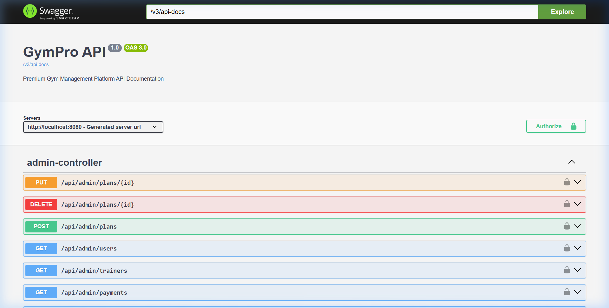

# 💎 GymPro – Premium Gym Management Platform

GymPro is a full-stack SaaS application for gym owners, trainers, and members. It features a robust Spring Boot backend and a high-performance React (Vite) frontend with a focus on premium aesthetics and user experience.

## 📸 Screenshots

### Premium Frontend Dashboard


### Backend API Documentation (Swagger)


## 🚀 Quick Start with Docker

The easiest way to get GymPro up and running is using Docker Compose.

1.  **Clone the repository**.
2.  **Run Docker Compose**:
    ```bash
    docker-compose up --build
    ```
3.  **Access the applications**:
    -   Frontend: [http://localhost](http://localhost)
    -   Backend API Docs (Swagger): [http://localhost:8080/swagger-ui/index.html](http://localhost:8080/swagger-ui/index.html)

## 🛠 Tech Stack

### Backend
-   **Java 17** & **Spring Boot 3**
-   **Spring Security** (JWT Authentication)
-   **Spring Data JPA** (MySQL Persistence)
-   **MapStruct** & **Lombok**
-   **Swagger/OpenAPI**

### Frontend
-   **React (Vite)**
-   **Tailwind CSS** (Premium Dark UI)
-   **Redux Toolkit** (State Management)
-   **Framer Motion** (Smooth Animations)
-   **Chart.js** (Dashboard Analytics)
-   **Lucide React** (Icons)

## 👤 Predefined Roles & Logic
-   **Admin**: Manage users, plans, and global analytics.
-   **Trainer**: Manage assigned members, create workout plans, and track attendance.
-   **Member**: Dashboard overview, choose and purchase plans (Razorpay), track personal workouts.
-   
## 🔒 Security
-   JWT-based stateless authentication.
-   Role-based access control (RBAC).
-   Password hashing with BCrypt.
-   
## 💳 Payment Integration
-   Integrated with **Razorpay** SDK.
-   Currently implements mock payment verification logic for demonstration.
---

Crafted for excellence by GymPro Team.
